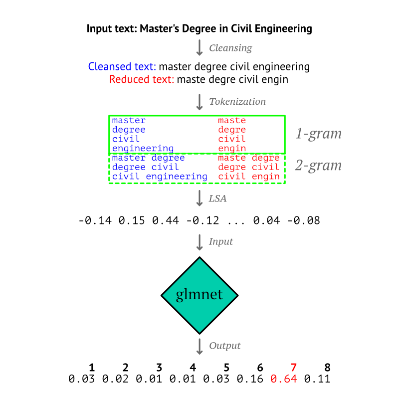

```{r, include = FALSE}
knitr::opts_chunk$set(
  collapse = TRUE,
  comment = "#>"
)
```

```{r setup}
library(educationR)
```

# Overview

In various instances, information related to a person's education level may be available in the form of a qualification title sourced from a CV or an online resource (e.g., a LinkedIn profile), but not mapped to a particular reference classification. The educationR package provides functionality for classifying free text from a qualification title into the European Qualifications Framework (EQF). The EQF was developed as a translation tool to make national qualifications from countries in the European Union easier to understand and more comparable. It defines eight reference levels tied to specific learning outcomes, ranging from basic (Level 1) to advanced (Level 8).

# Usage examples

The `predict_eqf` function is used to classify free text with respect to EQF:
```{r}
titles <- c(
  "Master of Science", 
  "PhD in Linguistics", 
  "Laurea triennale in Ingegneria Industriale")
predict_eqf(titles)
```

# Classification of EQF level

{width=75%}

## Dataset

The dataset used to train the EQF level classifier in educationR is derived from qualification examples found on CVs. Along with the associated free text, CV owners have attached the EQF level that corresponds to a particular qualification title or educational achievement. This labelled data is split into the train and test sets used to derive the model and test it.

## Feature extraction

Every example in the dataset is composed of a document (i.e., the unstructured, free text used as a qualification title) and a label (1 through 8) representing its EQF level. To train a predictive model using this data, a pre-processing step where the documents are embedded into a vector space is required. Latent semantic analysis (LSA) is used for this purpose, which is a natural language processing technique for analyzing the relationship between a set of documents and the terms they include. Specifically, we use apply LSA on a tf-idf transformed document-term matrix using the `text2vec` package. A cleansing step is applied initially to simplify text, remove common words, as well as reduce terms to a specified maximum length.

## Training

Using documents embedded on the previously defined vector space as input, and their equivalent EQF level (between 1 and 8) as output, a multinomial logistic regression model is trained using `glmnet` with 4-fold cross-validation. Documents from each language are treated separately, resulting in one model per language.

# Supported languages

The languages supported are shown on the table below. If the ISO 639-1 code of a language is provided as parameter `locale` in `predict_eqf()`, input free text is classified with respect to the given language.

```{r, echo = FALSE}
lang <- ISOcodes::ISO_639_2[, c("Alpha_2", "Name")]
names(lang) <- c("Code", "Name")
knitr::kable(lang[match(get_languages_eqf(), lang$Code),], row.names = FALSE)
```
