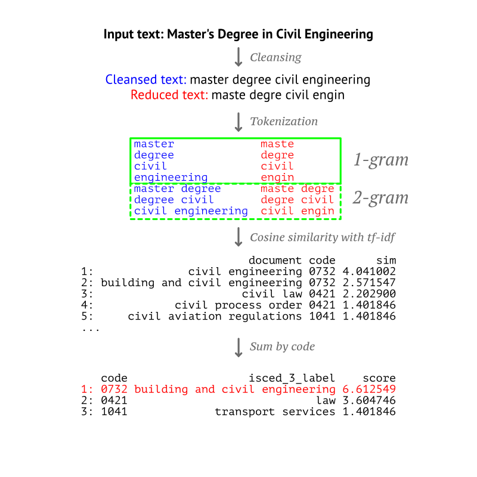

```{r, include = FALSE}
knitr::opts_chunk$set(
  collapse = TRUE,
  comment = "#>"
)
```

```{r setup}
library(educationR)
```

# Overview

A person's participation in an education or training programme is often available in the form of a qualification title on their CV, their LinkedIn profile, or other similar sources. For the purpose of statistical analysis (e.g., in labour market research) and other applications, it is often required to know which academic discipline or field of study corresponds to these qualification titles. The educationR package allows matching free text with the International Standard Classification of Education's Fields of Education and Training (ISCED-F 2013). ISCED-F 2013 is a classification of fields of education maintained by UNESCO to increase the international comparability of education statistics. It defines a hierarchy of 11 broad fields (2 digits), 29 narrow fields (3 digits), and about 80 detailed fields (4 digits).

# Usage examples

The `predict_isced_f` function is used to classify free text with respect to EQF:
```{r}
titles <- c(
  "Master of Science in Biology", 
  "PhD in Linguistics", 
  "Certificate in hairdressing")
predict_isced_f(titles)
```

# Matching free text with ISCED fields

{width=75%}

## Corpus

Matching qualification titles with ISCED fields is performed through document similarity comparison. The corpus of documents used is based primarily on the fields' labels provided by UNESCO. In addition to that, the ESCO classification is used to enhance this corpus. Specifically, ESCO utilizes ISCED-F 2013 as the Knowledge branch of its Skills & Competences hierarchy, providing translations of the fields' labels in over 27 languages, and associated skills and competences are attached as leaf nodes to each of the 80 detailed fields. As a result, over 2800 documents based on ESCO skills (e.g., "agritourism", "sightseeing information" and "travel booking policies" for ISCED field "travel tourism and leisure") are added to corpus.

## Pre-processing

Every document is composed of a text label and the 4-digit code of the ISCED field to which it corresponds. Documents are initially cleansed to simplify text, remove common words, and reduce terms to a specified maximum length. The `text2vec` package is used to produce the document-term matrix and transform it based on tf-idf, so to reflect how important a term is to each document.

## Matching

Input text is vectorized and compared to all documents in the corpus. A similarity score based on cosine similarity with tf-idf is produced between input free-text and the ISCED-F / ESCO skills documents. Score is summed by ISCED-F code, and the code with the highest score is given as output.

# Supported languages

The languages supported are shown on the table below. The ISO 639-1 code of a language must be provided as parameter `locale` in `predict_isced_f()`.

```{r, echo = FALSE}
lang <- ISOcodes::ISO_639_2[, c("Alpha_2", "Name")]
names(lang) <- c("Code", "Name")
knitr::kable(lang[match(get_languages_isced_f(), lang$Code),], row.names = FALSE)
```
